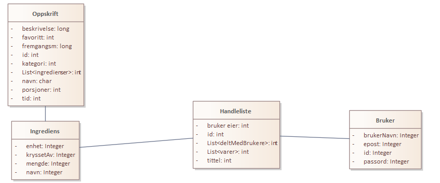

# Handleliste
Applikasjon for handleliste og oppskrifter

Hovedhensikt:
Handleliste+ skal gjøre det lettere å finne ut hva man skal spise, samt gjøre det lettere å handle matvarene som trengs.

## Datamodell

Neste steg, begynn programmeringen i java på nytt, med fokus på forståelse fremfor effektivitet. Oppskrift er kopiert, forstå den, og bruk den som utgangspunkt til å skrive de neste selv!
